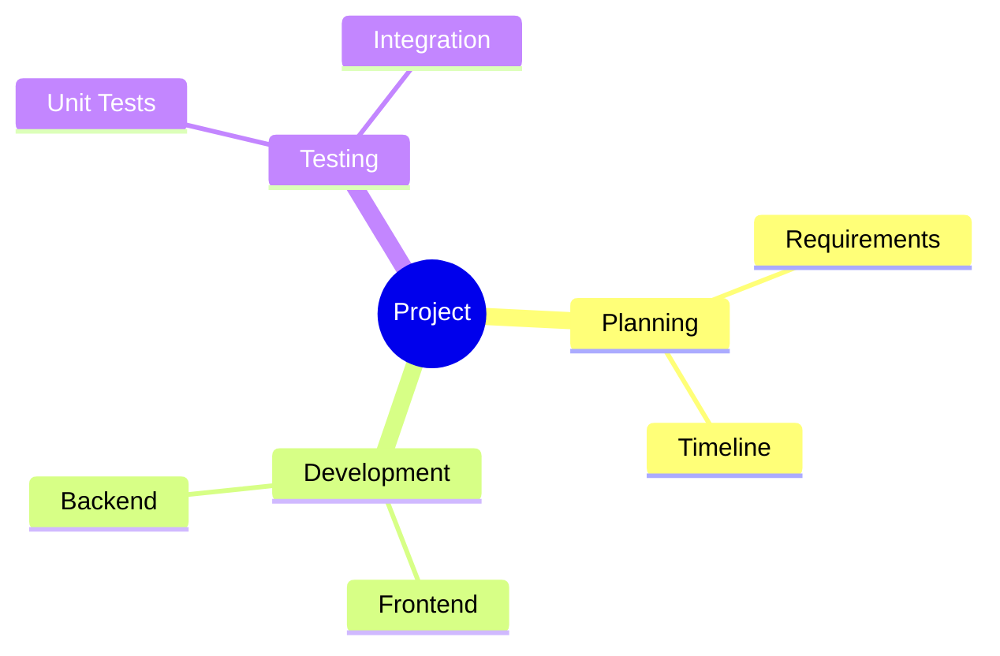

# GVS – Klausurlösungen nach Folien

> **Bearbeitbare Markdown-Version mit größerem Abstand und Vektorgrafiken**  

> Reihenfolge: **Woche → Originalfrage → Antwort**.  

> Bei mehrfach vorkommenden Fragen wird die Lösung nur einmal aufgeführt; die Klausurtermine stehen jeweils dabei.

# ==Woche 1 – K01: Einführung


<br>
<div class="card">
<style>*:{color: #1e1e1e}</style>
  <div class="loader">
    <p>loading</p>
    <div class="words">
      <span class="word">buttons</span>
      <span class="word">forms</span>
      <span class="word">switches</span>
      <span class="word">cards</span>
      <span class="word">buttons</span>
    </div>
  </div>
</div>


## 1. Begriff: Verteiltes System

**Vorgekommen in:** 16.09.2025 A1a; 17.09.2024 A1a; 23.07.2024 A1a


### Originalfrage aus der Klausur

```text
a) Definieren Sie den Begriff „Verteiltes System“. (1 P.)
```


<br>

### Antwort


Mehrere autonome, vernetzte Rechner arbeiten gemeinsam an einer Aufgabe.

<br><br>

---

# ==Woche 2 – K02: Architekturen

## 1. Peer-to-Peer - Multiple Choice

**Vorgekommen in:** 19.07.2023 A1a


### Originalfrage aus der Klausur

```text
Welche Aussage beschreibt Peer-to-Peer-Systeme korrekt?
```

### Antwort


- **Richtig:** Jeder Rechner ist gleichzeitig Anbieter und Konsument.
- Die anderen Aussagen sind falsch.

<br>

## 2. Edge-Computing - Multiple Choice

**Vorgekommen in:** 19.07.2023 A1b; 21.09.2023 A1b


### Originalfrage aus der Klausur

```text
Welche Aussagen zu Edge-Computing sind richtig?
```


<br>

### Antwort


- **Richtig:** Rechenleistung auf IoT-/Edge-Geräten; Verarbeitung nahe der Datenquelle.
- Graphkanten sind damit nicht gemeint.

# ==Woche 3 – K03: Grundlagen


<br>

## 1. Lost Update

**Vorgekommen in:** 29.07.2026 A1a; 16.09.2025 A1c


### Originalfrage aus der Klausur

```text
a) Was bedeutet „lost update“ im Zusammenhang mit Multithreading? (2 P.)
Wie kann dieses Problem vermieden werden?
Erklärung:
Vermeidung:
```


<br>

### Antwort


- **Lost Update:** Zwei Threads ändern dieselbe Variable; ein Update wird überschrieben.
- **Vermeidung:** kritischen Abschnitt sperren, z. B. `synchronized`.

<br><br>

---


# ==Woche 4 – K04: Sockets


<br>

## 1. Verlorene Nachrichten bei TCP

**Vorgekommen in:** 16.09.2025 A2a


### Originalfrage aus der Klausur

```text
a) Was passiert bei TCP mit verloren gegangen Nachrichten? (1 P.)
```


<br>

### Antwort


TCP erkennt den Verlust und sendet die fehlenden Daten erneut.

<br>

## 2. IP-Adresse und Port beim TCP-Verbindungsaufbau

**Vorgekommen in:** 16.09.2025 A2b; 17.09.2024 A1c


### Originalfrage aus der Klausur

```text
b) Wofür benötigt man für den Verbindungsaufbau über TCP zu einem Server (2 P.)
eine IP-Adresse und eine Port-Nummer?
```


<br>

### Antwort


- **IP-Adresse:** Zielrechner.
- **Port:** Dienst/Prozess auf diesem Rechner.

<br>

## 3. Warum skaliert "ein Thread pro Client" schlecht?

**Vorgekommen in:** 16.09.2025 A2c


### Originalfrage aus der Klausur

```text
c) Warum skaliert ein Server hinsichtlich der Anzahl an Clients schlecht, falls für (2 P.)
jede Client-Verbindung ein eigener Thread verwendet wird? Wie kann die
Skalierbarkeit des Servers verbessert werden?
```


<br>

### Antwort


Viele Threads brauchen viel Speicher und Scheduling-Aufwand. **Besser:** asynchrone Sockets oder Thread-Pool.

<br>

## 4. TCP und UDP

**Vorgekommen in:** 17.09.2024 A2a; 21.09.2023 A2a; 19.07.2023 A1c


### Originalfrage aus der Klausur

```text
a) Erläutern Sie die Unterschiede zwischen TCP und UDP. Nennen Sie dabei (4 P.)
jeweils ein Anwendungsbeispiel, für welches das jeweilige Protokoll besser
geeignet ist.
```


<br>

### Antwort


| TCP | UDP |
|---|---|
| verbindungsorientiert, zuverlässig, Reihenfolge garantiert | verbindungslos, keine Zustell-/Reihenfolgegarantie |
| z. B. HTTPS/SSH | z. B. Streaming |

<br>

## 5. Asynchrone TCP-Sockets

**Vorgekommen in:** 21.09.2023 A2b


### Originalfrage aus der Klausur

```text
Wann sind asynchrone TCP-Sockets sinnvoll?
```


<br>

### Antwort


Sinnvoll bei sehr vielen gleichzeitigen Verbindungen: Ein Thread kann mehrere Sockets bedienen.

<br><br>

---


# ==Woche 5 – K05: Remote Procedure Call


<br>

## 1. Komponenten eines RPC

**Vorgekommen in:** 29.07.2026 A2a; 23.07.2024 A7a; 21.09.2023 A2c


### Originalfrage aus der Klausur

```text
a) Skizzieren und erläutern Sie kurz die beteiligten Komponenten bei (6 P.)
einem Remote Procedure Call (RPC).
```


### Vorgehensweise / Lösungsschritte


1. Client ruft Stub auf.
2. Stub sendet Request.
3. Skeleton ruft Serverfunktion auf.
4. Ergebnis kommt denselben Weg zurück.

<br>

### Antwort


**Client → Client-Stub → Netzwerk → Server-Skeleton → Serverfunktion → zurück.**
Stub/Skeleton übernehmen das Verpacken und Entpacken der Daten.


<br>

## 2. Parameterübergabe bei RPC

**Vorgekommen in:** 29.07.2026 A2b; 23.07.2024 A7b; 21.09.2023 A2d


### Originalfrage aus der Klausur

```text
b) Erläutern Sie die Parameterübergabe für primitive Datentypen und 
Referenzen bei einem RPC. Wie heißt jeweils der Fachbegriff? (4 P.)
Primitive Datentypen:
Referenzen:
```


<br>

### Antwort


- Primitive Werte: **Call-by-Value / Result / Value-Result**.
- Referenzen: keine rohe Adresse übertragen; Objekt kopieren/serialisieren oder entfernte Referenz verwenden.
## 3. RPC: At-Least Once

**Vorgekommen in:** 17.09.2024 A2b


### Originalfrage aus der Klausur

```text
b) Eine Möglichkeit mit einem Timeout bei einem Remote Procedure Call (RPC) umzugehen heißt At-Least Once:

1. Beschreiben Sie das Vorgehen des Clients bei dieser Methode.(1P.)
2. Welches Problem kann hierbei serverseitig auftreten? (2 P.)
3. Wie kann der Server damit umgehen? (2 P.)
```


### Vorgehensweise / Lösungsschritte


1. Request senden.
2. Bei Timeout erneut senden.
3. Server erkennt Duplikate über Request-ID.

<br>

### Antwort


- Client sendet bei Timeout erneut.
- Aufruf kann **mehrfach** ausgeführt werden.
- Lösung: eindeutige Request-ID; Duplikate erkennen.

<br><br>

---


# ==Woche 6 – K06: Distributed Shared Memory


<br>

## 1. DSM vs. Message Passing

**Vorgekommen in:** 16.09.2025 A2d


### Originalfrage aus der Klausur

```text
d) Nennen Sie jeweils einen Vorteil eines Distributed Shared Memory (DSM) und  einem System welches Message Passing verwendet. (2 P.)
```


### Antwort


- **DSM:** einfacher wie gemeinsamer Speicher.
- **Message Passing:** mehr Kontrolle und oft bessere Performance.

<br>

## 2. Speicherzugriffserkennung beim seitenbasierten DSM

**Vorgekommen in:** 29.07.2026 A2c1; 23.07.2024 A7c1


### Originalfrage aus der Klausur

```text
1. Wie wird hierbei die Speicherzugriffserkennung realisiert? (1 P.)
```


<br>

### Antwort


Über **Page Faults**: Fehlt die Seite lokal, wird sie über das Netzwerk geholt.

<br>

## 3. False Sharing

**Vorgekommen in:** 29.07.2026 A2c2; 16.09.2025 A2e; 23.07.2024 A7c2


### Originalfrage aus der Klausur

```text
2. Was ist False Sharing und wie kann dieses Problem vermieden werden? (2 P.)
False Sharing:
Lösung:
```


<br>

### Antwort


- Mehrere unabhängige Daten liegen auf derselben Seite; dadurch wird die ganze Seite unnötig übertragen.
- **Lösung:** Daten auf verschiedene Seiten legen / kleinere Granularität.

<br><br>

---


# Woche 7 – K07: Zeit


<br>

## 1. Uhrensynchronisierung nach Cristian

**Vorgekommen in:** 29.07.2026 A1b; 16.09.2025 A1d


### Originalfrage aus der Klausur

```md
b) Wie funktioniert die Uhrensynchronisierung nach Cristian? Erläutern Sie den (3 P.)
Algorithmus mithilfe einer Skizze.
Zeit
Server
Client
Zeit
```


### Vorgehensweise / Lösungsschritte


1. Anfrage senden.
2. RTT messen.
3. Uhr auf `Serverzeit + RTT/2` setzen.

<br>

### Antwort


Client fragt Zeitserver, misst die **RTT** und setzt seine Uhr ungefähr auf **Serverzeit + RTT/2**.

![[Pasted image 20260828120553.png]]
<br>


## 2. Network Time Protocol - Multiple Choice

**Vorgekommen in:** 21.09.2023 A1c


### Originalfrage aus der Klausur

```text
Welche Aussage zu NTP ist richtig?
```


![[Pasted image 20260828121014.png|435]]

<br>

### Antwort


- **Richtig:** NTP tauscht Zeitstempel aus.
- NTP verwendet **UDP**, nicht TCP.

<br>

## 3. Allgemeine Methode für Lamport- und Vektorzeit

**Vorgekommen in:** 16.09.2025 A5; 17.09.2024 A5; 23.07.2024 A5; 21.09.2023 A3; 19.07.2023 A2

Lamport-Zeit:
![[Pasted image 20260828121118.png]]

Vektor-Zeit:
![[Pasted image 20260828121148.png|700]]
### Lösungsmethode

Wie berechnet man Lamport- und Vektorzeiten?


### Vorgehensweise / Lösungsschritte


1. Lamport: lokal `+1`, Empfang `max()+1`.
2. Vektor: eigene Komponente `+1`, beim Empfang komponentenweise `max`.

<br>

### Antwort


- **Lamport:** lokal/Senden `+1`; Empfangen `max(lokal, empfangen)+1`.
- **Vektor:** eigene Komponente `+1`; beim Empfang komponentenweise `max`.
- Nur Vektorzeit zeigt Nebenläufigkeit direkt.

<br>

## 9. Logische Zeit - Sonderaufgabe 29.07.2026

**Vorgekommen in:** 29.07.2026 A5


### Originalfrage aus der Klausur

![[Pasted image 20260828121458.png]]


### Vorgehensweise / Lösungsschritte

1. Ein Sprung einer Lamportuhr, der nicht durch lokale +1-Fortsetzung erklaerbar ist, benötigt einen Empfang von einer entsprechend großen Senderzeit.
2. So wenig Nachrichten wie möglich wählen.
3. Danach Vektoren entlang der gegebenen Pfeile berechnen.

<br>

### Antwort


- **Minimale Nachrichten:** 3.
- Eine gültige Wahl: `A2→B3`, `B4→C5`, `C6→A7`.
- Vektorzeiten anschließend mit der Standardregel berechnen.


<br><br>

---


# ==Woche 8 – K08: Koordination

<br>
## 1. Bully-Algorithmus

**Vorgekommen in:** 16.09.2025 A4a


### Originalfrage aus der Klausur

```text
a) Beschreiben Sie in Stichpunkten wie der Bully-Algorithmus funktioniert. (4 P.)
```


### Vorgehensweise / Lösungsschritte


1. ELECTION an höhere IDs.
2. Höherer Prozess übernimmt Wahl.
3. Höchste erreichbare ID wird Koordinator.

<br>

### Antwort


Bei Koordinatorausfall senden Prozesse **ELECTION** an höhere IDs. Am Ende wird der erreichbare Prozess mit der **höchsten ID** Koordinator.

<br>

## 2. Lamport-Algorithmus für gegenseitigen Ausschluss - Grundidee

**Vorgekommen in:** 29.07.2026 A4; 16.09.2025 A4b


### Lösungsmethode

Welche Schritte benutzt das Lamport-Verfahren?


### Vorgehensweise / Lösungsschritte


1. REQUEST an alle.
2. Queue nach `(Zeit,PID)`.
3. Eintritt bei allen REPLYs + eigenem Request vorne.
4. Danach RELEASE.

<br>

### Antwort


REQUEST an alle → Queue nach **(Zeit, PID)** sortieren → Eintritt erst bei allen REPLYs und eigenem Request vorne → danach RELEASE.

<br>

## 3. Lamport-Mutex - Klausur 29.07.2026

**Vorgekommen in:** 29.07.2026 A4


### Originalfrage aus der Klausur
![[Pasted image 20260828122751.png]]


### Vorgehensweise / Lösungsschritte

1. Beide Requests überall eintragen und nach Zeitstempel sortieren.
2. (3,3) steht vor (5,1), daher darf P3 zuerst hinein.
3. Nach RELEASE von P3 wird (3,3) überall entfernt; danach ist P1 an der Reihe.

<br>

### Antwort


`(3,3)` steht vor `(5,1)` → **P3 zuerst**, danach RELEASE → **P1**.


<br>

## 4. Lamport-Mutex - Klausur 16.09.2025

**Vorgekommen in:** 16.09.2025 A4b


### Originalfrage aus der Klausur

```text
b) In dieser Aufgabe geht es um den verteilten Algorithmus nach Lamport, welcher (10 P.)
einen gegenseitigen Ausschluss realisiert. In der nachfolgenden Skizze sind die
Pfeile für die Requests für den Eintritt in den kritischen Abschnitt von P2 und P3
gegeben. Zeichnen Sie alle Nachrichten des Protokolls ein und notieren Sie bei
den Empfangsereignissen immer den Zustand der Warteschlange. Die Länge
des kritischen Abschnitts können Sie frei wählen.
[(3,1)]
P1
P2
P3
[(5,3)]
Reserve-Skizze – bitte klar kenntlich machen, welche Skizze für die Korrektur verwendet
werden soll!
[(3,1)]
P1
P2
P3
[(5,3)]
```


### Vorgehensweise / Lösungsschritte

1. Requests verteilen und sortieren.
2. (3,1) steht vor (5,3), daher tritt P1 zuerst ein.
3. Danach RELEASE von P1, dann darf P3 eintreten.

<br>

### Antwort


`(3,1)` steht vor `(5,3)` → **P1 zuerst**, danach RELEASE → **P3**.


<br>

## 5. Vektorverfahren nach Mattern zur Terminierung

**Vorgekommen in:** 21.09.2023 A5e


### Originalfrage aus der Klausur

```text
Fehlende lokale Vektoren und Kontrollvektor ergänzen; Terminierung bei T1 entscheiden.
```


<br>

### Antwort


Diese konkrete Aufgabe ist mit den bereitgestellten Folien **nicht vollständig lösbar**, da die benötigten Rechenregeln dort fehlen.

> **Hinweis:** Bewusst keine Fremdlösung: Der Nutzer hat verlangt, Antworten ausschliesslich aus den Folien abzuleiten. Deshalb werden die fehlenden Zahlen hier nicht aus externem Wissen oder der Discord-Lösungsdatei ergänzt.


<br><br>

---


# ==Woche 9 – K09: Replikation und Konsistenz


## 1. Konsistenz und Kohärenz

**Vorgekommen in:** 29.07.2026 A3c; 16.09.2025 A3a; 19.07.2023 A3c


### Originalfrage aus der Klausur

```text
c) Erläutern Sie den Unterschied zwischen Konsistenz und Kohärenz. (2 P.)
```

### Antwort


- **Konsistenz:** Wann wird eine Änderung sichtbar?
- **Kohärenz:** Wie wird die Änderung verteilt?

<br>

## 2. Schwache Konsistenz (sync): Vorteil/Nachteil

**Vorgekommen in:** 16.09.2025 A3b; 21.09.2023 A1e; 19.07.2023 A1e
![[Pasted image 20260828181934.png]]

### Originalfrage aus der Klausur

```text
b) Nennen Sie je einen Vor- und einen Nachteil der schwachen Konsistenz. (2 P.)
```


<br>

### Antwort


- **Vorteil:** hohe Nebenläufigkeit / weniger Kommunikation.
- **Nachteil:** ohne korrektes `sync()` können alte Werte gelesen werden.

<br>

## 3. Strikte Konsistenz

**Vorgekommen in:** 16.09.2025 A3c

![[Pasted image 20260828181726.png|700]]
### Originalfrage aus der Klausur

```text
c) Wie lautet die Definition von strikter Konsistenz? (1 P.)
```

### Antwort


Jeder Read liefert den **global zuletzt geschriebenen Wert**.
## 4. Sequentielle Konsistenz

**Vorgekommen in:** 16.09.2025 A3d

![[Pasted image 20260828181839.png]]
### Originalfrage aus der Klausur

```text
d) Wie lautet die Definition von sequentieller Konsistenz? (3 P.)
```
````


````

2


```mermid
pie title NETFLIX "Time spent looking for movie" : 90 "Time spent watching it" : 10

```
```
<br>
```java
class Main{
public static void main(){
} // output: IntStream

}
```
### Antwort


Alle Operationen müssen sich als **eine gemeinsame Reihenfolge** darstellen lassen; die Reihenfolge jedes Prozesses bleibt erhalten.

<br>

## 5. Write-Update vs. Write-Invalidate

**Vorgekommen in:** 17.09.2024 A3c; 23.07.2024 A3a; 21.09.2023 A4b; 19.07.2023 A3d


### Originalfrage aus der Klausur

```text
c) Erläutern Sie wie Write-Update und Write-Invalidate funktioniert und wann welches Verfahren besser ist. (4 P.)
```


### Antwort


- **Write-Update:** neuen Wert senden → gut bei vielen Reads.
- **Write-Invalidate:** Kopien ungültig machen → gut bei vielen Writes.

<br>

## 6. Aktualisierende Operationen

**Vorgekommen in:** 23.07.2024 A3b


### Originalfrage aus der Klausur

```text
b) Für die Aktualisierung von Replikaten kann man auch aktualisierende Operationen über das Netzwerk versenden. Was ist hierbei ein Vorteil und was muss beachtet werden, damit dies überhaupt gemacht werden kann?  (2 P.)
```


<br>

### Antwort


- **Vorteil:** weniger Datenverkehr als kompletter Datenblock.
- **Bedingung:** Operation muss deterministisch sein und überall dieselben Daten haben.

<br>

## 7. Vorteil quorenbasierter Replikation

**Vorgekommen in:** 21.09.2023 A4a


### Originalfrage aus der Klausur

```text
Welchen Vorteil bietet ein Quorum?
```


<br>

### Antwort


Nicht alle Replikate müssen erreichbar sein; überlappende Quoren ermöglichen trotzdem aktuelle Reads/Writes.

<br>

## 8. Schwache Konsistenz - Sync-Variante 23.07.2024

**Vorgekommen in:** 23.07.2024 A3c


### Originalfrage aus der Klausur

```text
c) Gegeben sei das nachfolgende Speicherzugriffsmuster. Tragen Sie minimal viele (5 P.)
Sync-Befehle ein, sodass die gelesenen Werte gemäß der schwachen Konsistenz
erzwungen werden.
w1(a)4
Prozess 1
w2(a)2 r2(a)2 r2(a)4
Prozess 2
r3(a)2 r3(a)4
Prozess 3
Hinweis: w2(a)1 beschreibt das Schreiben des Wertes 1 durch den Prozess 2
an die Speicherstelle a und r1(b)2 das Lesen des Wertes 2 durch den Prozess 1
an der Speicherstelle b.
```


### Vorgehensweise / Lösungsschritte


1. Writer veröffentlicht mit `sync()`.
2. Reader führt vor dem benötigten Read `sync()` aus.

<br>

### Antwort


Minimal **5 syncs**: P2 nach `w(a)=2`; P3 vor `r(a)=2`; P1 nach `w(a)=4`; P2 vor `r(a)=4`; P3 vor `r(a)=4`.

<br>

## 9. Schwache Konsistenz - Sync-Variante 19.07.2023

**Vorgekommen in:** 19.07.2023 A3e


### Originalfrage aus der Klausur

```text
Minimal viele sync()-Befehle für a und b eintragen.
```


### Vorgehensweise / Lösungsschritte


Writer synchronisieren → Reader synchronisieren → benötigten Wert lesen.

<br>

### Antwort


Minimal **4 syncs**: P2 nach den Writes; P3 vor erstem Read; P1 nach `w(a)=4`; P2 vor `r(a)=4`.

<br>

## 10. Schwache Konsistenz - Aufgabe 29.07.2026

**Vorgekommen in:** 29.07.2026 A3d


### Originalfrage aus der Klausur

```text
d) Gegeben sei das nachfolgende Speicherzugriffsmuster. Tragen Sie minimal viele Sync-Befehle ein, sodass die gelesenen Werte gemäß der schwachen Konsistenz erzwungen werden.  (5 P.)

Hinweis: w(x)1 steht für das Schreiben des Wertes 1 und r(x)2 für das Lesen des Wertes 2 an der Speicherstelle x.
```


<br>

### Antwort


Die Aufgabe ist in der abgedruckten Form **widersprüchlich**: Es gibt keinen Write `a=4`, obwohl später `a=4` gelesen werden soll.

> **Hinweis:** Falls im Diagramm statt w(b)=4 eigentlich w(a)=4 gemeint war, wäre die Aufgabe analog zur Variante vom 23.07.2024 lösbar. Diese Korrektur wird hier aber nicht stillschweigend angenommen.


<br>

## 11. Strikte/sequentielle Konsistenz - Muster A

**Vorgekommen in:** 16.09.2025 A3e; 17.09.2024 A3d


### Originalfrage aus der Klausur

![[Pasted image 20260828182436.png]]


### Vorgehensweise / Lösungsschritte


1. Strikt: letzten realen Write prüfen.
2. Sequentiell: mögliche gemeinsame Reihenfolge prüfen.

<br>

### Antwort


- **Strikt:** nein, weil Reads nicht den letzten realen Write liefern.
- **Sequentiell:** nein, weil P3 und P4 widersprüchliche Write-Reihenfolgen verlangen.

<br>

## 12. Strikte/sequentielle Konsistenz - Muster B

**Vorgekommen in:** 21.09.2023 A4c


### Originalfrage aus der Klausur

```text
W1(x)=1, W1(x)=2, W2(x)=3; P3 liest 1,3,2 und P4 liest 3,1,2.
```


### Vorgehensweise / Lösungsschritte


1. Strikt: letzten realen Write prüfen.
2. Sequentiell: Write-Reihenfolgen aus den Reads ableiten.

<br>

### Antwort


- **Strikt:** nein.
- **Sequentiell:** nein; P3 verlangt `W1 < W2`, P4 dagegen `W2 < W1`.

<br><br>

---


# ==Woche 10 – K10: Fehlertoleranz


<br>

## 1. Crash-Failure und Byzantine-Failure

**Vorgekommen in:** 16.09.2025 A1b


### Originalfrage aus der Klausur

```text
b) Erläutern Sie die beiden Fehlermodelle Crash-Failure und Byzantine-Failure. (2 P.)
Crash-Failure:
Byzantine-Failure:
```


<br>

### Antwort


- **Crash:** Prozess fällt aus und antwortet nicht mehr.
- **Byzantine:** Prozess kann beliebig/falsch handeln.

<br>

## 2. Verfügbarkeit und Zuverlässigkeit

**Vorgekommen in:** 21.09.2023 A5c


### Originalfrage aus der Klausur

```text
Definieren Sie availability und reliability.
```


<br>

### Antwort


- **Availability:** Wahrscheinlichkeit, dass das System jetzt funktioniert.
- **Reliability:** Zeit, in der es korrekt funktioniert.

<br>

## 3. CAP und CAP-Theorem

**Vorgekommen in:** 29.07.2026 A3a/b; 17.09.2024 A3a/b; 21.09.2023 A5a/b; 19.07.2023 A3a/b


### Originalfrage aus der Klausur

```text
a) Geben Sie an, für welches Wort jeder Buchstabe der Abkürzung CAP steht (3 P.)
und welche Bedeutung damit verbunden ist.
Ausgeschrieben Bedeutung
C
A
P

b) Erläutern Sie in einem Satz, was das CAP-Theorem aussagt. (1 P.)
```


<br>

### Antwort


- **C:** Consistency = letzter Wert wird gelesen.
- **A:** Availability = jede Anfrage wird beantwortet.
- **P:** Partition Tolerance = funktioniert trotz Netzpartition.
- Bei Partition kann man **C und A nicht gleichzeitig vollständig garantieren**.

<br>

## 4. Orphan Message beim Checkpointing

**Vorgekommen in:** 17.09.2024 A1b; 23.07.2024 A1d


### Originalfrage aus der Klausur

```text
b) Was ist eine Orphan-Message im Zusammenhang mit verteiltem Checkpointing? (2 P.)
Was passiert im Recovery-Fall mit einer Orphan-Message?
```


<br>

### Antwort


Empfang ist im Checkpoint enthalten, das Senden aber nicht. Ein konsistenter Checkpoint darf **keine Orphan Message** enthalten.

<br>

## 5. Aktive Fehlererkennung - Multiple Choice

**Vorgekommen in:** 21.09.2023 A1f


### Originalfrage aus der Klausur

```text
Welche Aussagen sind richtig?
```


<br>

### Antwort


- **Richtig:** Heartbeats + Timeout.
- Perfekte sofortige Ausfallerkennung ist nicht möglich.

<br>

## 6. Koordiniertes Checkpointing - Multiple Choice

**Vorgekommen in:** 21.09.2023 A1d


### Originalfrage aus der Klausur

```text
Welche Aussage ist richtig?
```


<br>

### Antwort


- **Richtig:** Checkpoints werden koordiniert; dadurch wird der Domino-Effekt vermieden.
- Anti-Entropy gehört nicht dazu.

<br>

## 7. Unabhängiges Checkpointing - Multiple Choice

**Vorgekommen in:** 19.07.2023 A1f


### Originalfrage aus der Klausur

```text
Welche Aussagen sind richtig?
```


<br>

### Antwort


- Recovery-Line muss berechnet werden.
- **Domino-Effekt** ist möglich.
- Das ganze System wird nicht angehalten.

<br><br>

---


# ==Woche 11 – K11: P2P-Systeme und Chord


<br>

## 1. Distributed Hash Table - Multiple Choice

**Vorgekommen in:** 21.09.2023 A1a


### Originalfrage aus der Klausur

```text
Welche Aussage zur DHT ist richtig?
```


<br>

### Antwort


**Richtig:** Der Hashraum wird in nicht überlappende Bereiche aufgeteilt.

<br>

## 2. Chord - allgemeine Lösungsmethode

**Vorgekommen in:** 29.07.2026 A6; 16.09.2025 A6; 17.09.2024 A6; 23.07.2024 A6; 21.09.2023 A7; 19.07.2023 A6


### Lösungsmethode

Wie löst man Zuständigkeit, naive Suche, Fingertabelle und skalierbare Suche?


### Vorgehensweise / Lösungsschritte


1. Zuständigen Successor bestimmen.
2. Finger: `succ(n+2^i)`.
3. Immer zum größten passenden Finger springen.

<br>

### Antwort


- Zuständig: erster Knoten im Uhrzeigersinn mit `ID ≥ Key`.
- Finger `i`: `succ(n + 2^i)`.
- Suche mit Finger Table: **O(log N)**.

<br><br>

---


# ==Woche 12 – K12: Amazon Dynamo / Key-Value Storage


## 1. Virtual Nodes

![[Pasted image 20260830132157.png]]

**Vorgekommen in:** 16.09.2025 A7a; 19.07.2023 A7a


### Originalfrage aus der Klausur

```text
a) Welches Ziel verfolgt Dynamo durch den Einsatz von virtuellen Knoten? Wie funktioniert dieses Konzept?  (2 P.)

```


<br>

### Antwort


Ein physischer Server erhält mehrere Positionen im Ring → **gleichmäßigere Lastverteilung**.

<br>

## 2. Dynamo-Replikation im 3-Bit-Ring

**Vorgekommen in:** 17.09.2024 A7a; 19.07.2023 A7b


### Originalfrage aus der Klausur

```text
a) Gegeben sei nachstehender Ring (3 Bit Schlüsselraum). Geben Sie die Node-IDs  an, auf denen Key 0 repliziert wird. Node-ID = 0 ist der Koordinator für Key 0. Insgesamt soll es drei Replikate geben. Das Füllmuster der Kreise gibt jeweils die Zuordnung zu einem Server wieder. (2 P.)
Node-IDs:
```


### Vorgehensweise / Lösungsschritte


Im Uhrzeigersinn Replikate wählen; virtuelle Nodes desselben physischen Servers überspringen.

<br>

### Antwort


Replikate: **Node 0, 1 und 3**. Node 2 wird übersprungen, weil er zum selben physischen Server wie Node 0 gehört.

<br>

## 3. Vektorzeitstempel in Dynamo

**Vorgekommen in:** 16.09.2025 A7b; 17.09.2024 A7b; 23.07.2024 A1b; 19.07.2023 A7c


### Originalfrage aus der Klausur

```text
b) Wofür verwendet Amazon Dynamo Vektorzeitstempel? Nennen Sie einen  Unterschied bei der Implementierung der Vektorzeitstempel gegenüber der klassischen Vektorzeit. Welchen Nachteil handelt man sich durch diesen Unterschied ein? (3 P.)

Einsatzzweck:
Unterschied:
Nachteil:
```


<br>

### Antwort


- Zweck: Versionen vergleichen und Konflikte erkennen.
- Dynamo begrenzt/verkürzt Vektoren.
- Nachteil: selten kann ein Konflikt dadurch übersehen werden.

<br>

## 4. Dynamo-Quorum: N, W, R

**Vorgekommen in:** 16.09.2025 A7c; 17.09.2024 A7c


### Originalfrage aus der Klausur

```text
c) Amazon Dynamo verwendet eine Quoren-basierte Replikation.
Eine Bedingung hierbei lautet: W + R > N
Was bedeuten hierbei die Buchstaben, W, R und N?
Bedeutung (N,W,R) 
Warum muss die Ungleichung eingehalten werden?  (4 P.)
```


<br>

### Antwort


- `N` = Replikate, `W` = nötige Write-Antworten, `R` = gelesene Replikate.
- `W + R > N` → Read- und Write-Quorum überlappen sich.

<br><br>

---


# ==Woche 13 – K13: Google File System


## 1. Aufgaben des GFS-Masters und Entlastung

**Vorgekommen in:** 17.09.2024 A4a


### Originalfrage aus der Klausur

```text
a) Nennen Sie zwei Aufgaben des Masters und ein Konzept, welches den Master (2 P.)
entlastet, damit er nicht zum Flaschenhals des Dateisystems wird.
```


<br>

### Antwort


- Master: Metadaten/Chunk-Zuordnung, Replikate überwachen.
- Entlastung: große Chunks + Client-Caching; Daten gehen direkt zu Chunkservern.

<br>

## 2. Schreiben in eine GFS-Datei

**Vorgekommen in:** 17.09.2024 A4b


### Originalfrage aus der Klausur

```text
b) Beschreiben Sie die Schritte eines Clients beim Schreiben in eine GFS-Datei. (4 P.)
```


### Vorgehensweise / Lösungsschritte


Master fragen → Daten senden → Primary ordnet → Secondaries schreiben → ACK.

<br>

### Antwort


Client fragt Master → sendet Daten an Replikate → Primary legt Reihenfolge fest → Secondaries schreiben → ACK zurück.


<br>

## 3. GFS Record Append

**Vorgekommen in:** 17.09.2024 A4c; 23.07.2024 A1c


### Originalfrage aus der Klausur

```text
c) Das Google File System (GFS) bietet die Operation „record append“ an. (3 P.)
Welche Semantik hat diese Operation? Nennen Sie eine Inkonsistenz,
die in den Replikaten entstehen kann. Wie kann die Anwendung diese
Inkonsistenz erkennen und auflösen?
```


<br>

### Antwort


- Atomisches Append, aber **mindestens einmal**.
- Duplikate/Padding möglich.
- Anwendung erkennt Duplikate z. B. über eindeutige IDs.

<br><br>

---


# ==Woche 14 – K14: Transaktionen


## 1. Deadlock - Multiple Choice

**Vorgekommen in:** 19.07.2023 A1d


### Originalfrage aus der Klausur

```text
Welche Folge hat ein Deadlock?
```


<br>

### Antwort


**Richtig:** Die beteiligten Threads bleiben blockiert.

<br>

## 2. ACID

**Vorgekommen in:** 21.09.2023 A6a; 19.07.2023 A4a


### Originalfrage aus der Klausur

```text
Bedeutung der Buchstaben und Eigenschaft.
```


<br>

### Antwort


| A | Atomicity – alles oder nichts |
|---|---|
| C | Consistency – gültiger Zustand |
| I | Isolation – Transaktionen stören sich nicht |
| D | Durability – Ergebnis bleibt dauerhaft |

<br>

## 3. Zwei-Phasen-Sperrprotokoll: Nachteile

**Vorgekommen in:** 29.07.2026 A9a; 23.07.2024 A2a


### Originalfrage aus der Klausur

```text
a) Was sind zwei Nachteile des 2-Phasen-Sperrprotokolls? (2 P.)
```


<br>

### Antwort


- **Deadlocks**.
- **Cascading Aborts**.

<br>

## 4. Vermeidung der 2PL-Probleme

**Vorgekommen in:** 23.07.2024 A2a


### Originalfrage aus der Klausur

```text
a) Welche zwei Probleme können beim 2-Phasen-Sperrprotokoll auftreten? (3 P.)
Wie können diese beiden Probleme vermieden werden?
```


<br>

### Antwort


Striktes 2PL: alle Sperren zuerst holen und erst am Ende freigeben → keine Deadlocks/Folgeabbrüche; Sperren müssen vorher bekannt sein.

<br>

## 5. Wann optimistisch statt pessimistisch?

**Vorgekommen in:** 29.07.2026 A9b; 23.07.2024 A2b


### Originalfrage aus der Klausur

```text
b) Wann ist es besser, eine optimistische Synchronisierung zu verwenden, statt (1 P.)
eines pessimistischen Sperrverfahrens?
```


<br>

### Antwort


Wenn **Konflikte selten** sind und Transaktionen zurückgesetzt werden können.

<br>

## 6. Vorwärtsvalidierung - T4, Variante 2026/2024

**Vorgekommen in:** 29.07.2026 A9c; 23.07.2024 A2c


### Originalfrage aus der Klausur

```text
c) Gegeben sei der nachstehende Ablaufplan für vier Transaktionen. (5 P.)
r(y) w(x) r(x)
T1
r(x) r(y)
T2
r(x) w(y)
T3
r(x) w(y)
T4
Ermitteln Sie mithilfe der Vorwärtsvalidierung, ob die Transaktion T4 mit anderen
Transaktionen im Konflikt steht. Geben Sie die Menge active_set sowie die-
jenigen Mengen r_set und w_set an, welche vom Algorithmus betrachtet werden.
Begründen Sie für beide Fälle (Konflikt oder kein Konflikt) Ihre Entscheidung.
Mathematisch-Naturwissenschaftliche Fakultät
Institut für Informatik
Abt. Betriebssysteme
Prof. Dr. Michael Schöttner
Klausur zum Modul
Grundlagen Verteiler Systeme
am 16. September 2025
Bearbeitungszeit: 90 Minuten
Gesamtpunktzahl: 90 Punkte
Die vorliegende Klausur umfasst einschließlich Deckblatt 15 Blätter.
Bitte prüfen Sie die Vollständigkeit der Klausur, bevor Sie beginnen.
Beachten Sie bitte die Hinweise auf dem folgenden Blatt.
Mit Ihrer Unterschrift bestätigen Sie, dass Sie sich prüfungsfähig fühlen,
die Klausur auf Vollständigkeit überprüft und die Hinweise gelesen haben.
Vorname Nachname
Matrikelnummer
Unterschrift
Aufgabe 1 2 3 4 5 6 7 8 9 Summe
max. Punkte 8 9 13 14 10 11 9 7 9 90
erreichte
Punkte
Hinweise
• Stichpunkte genügen als Antwort.
• Es sind keine Hilfsmittel erlaubt.
• Schalten Sie ihr Mobiltelefon und Ihre Smartwatch aus und
verstauen Sie die Geräte in ihrer Tasche.
• Verwenden Sie keinen Bleistift und keinen roten Stift zum Schreiben.
• Schreiben Sie Ihre Antworten direkt auf die Aufgabenblätter oder auf zusätzliche
Blätter, die wir Ihnen zur Verfügung stellen.
• Achten Sie auf eine leserliche Form Ihrer Antworten (Text und Zeichnungen).
• Tragen Sie auf allen zusätzlichen Blättern Ihre Matrikelnummer und Ihren Namen ein.
Blätter, die nicht zugeordnet werden können, fließen nicht in die Bewertung ein.
• Für Teilaufgaben wird keine negative Gesamtpunktzahl vergeben.
Viel Erfolg!
```


### Vorgehensweise / Lösungsschritte


`active_set` bestimmen → für jedes aktive Tj: `r(Tj) ∩ w(T4)` prüfen.

<br>

### Antwort


- `active_set={T1,T3}`, `w(T4)={y}`.
- T1: `{x,y}∩{y}={y}` → **Konflikt**.
- T3: `{x}∩{y}=∅` → kein Konflikt.
- Ergebnis: **T4 konflikt mit T1**.

<br>

## 7. Vorwärtsvalidierung - T4, 21.09.2023

**Vorgekommen in:** 21.09.2023 A6b


### Originalfrage aus der Klausur

```text
T4 validieren; active_set und relevante Mengen angeben.
```


### Vorgehensweise / Lösungsschritte


`active_set` bestimmen → `r(Tj) ∩ w(T4)` prüfen.

<br>

### Antwort


`w(T4)=∅` → alle Schnitte leer → **kein Konflikt**.

<br>

## 8. Rückwärtsvalidierung - T1, 19.07.2023

**Vorgekommen in:** 19.07.2023 A4b


### Originalfrage aus der Klausur

```text
T1 mit Rückwärtsvalidierung prüfen.
```


### Vorgehensweise / Lösungsschritte


`finished_set` bestimmen → `r(T1) ∩ w(Tj)` prüfen.

<br>

### Antwort


`finished_set={T2}`; `r(T1)={x1,x2}`, `w(T2)={x1}` → Schnitt `{x1}` → **Konflikt, T1 abbrechen**.

<br><br>

---


# ==Woche 15 – K15: Konsensus

## 1. FLP-Theorem

**Vorgekommen in:** 17.09.2024 A9a; 23.07.2024 A4c; 21.09.2023 A5d


### Originalfrage aus der Klausur

```text
a) Was sagt das FLP-Theorem aus? Welche Auswirkung hat das Theorem auf (2 P.)
den Paxos-Algorithmus?
```


<br>

### Antwort


In einem asynchronen System mit Crashs kann Konsensus **nicht mit garantierter Terminierung** gelöst werden. Paxos bleibt sicher, kann aber theoretisch nicht terminieren.

<br>

## 2. Welches Problem löst Paxos?

**Vorgekommen in:** 19.07.2023 A8a


### Originalfrage aus der Klausur

```text
Beschreiben Sie das Ziel von Paxos.
```


<br>

### Antwort


Paxos erreicht **Konsensus über einen Wert**, solange ein Quorum erreichbar ist.

<br>

## 3. Paxos-Rollen

**Vorgekommen in:** 19.07.2023 A8b


### Originalfrage aus der Klausur

```text
Nennen Sie die vier Rollen.
```


<br>

### Antwort


| Rolle | Aufgabe |
|---|---|
| Proposer | Wert vorschlagen |
| Coordinator | Wahl steuern |
| Acceptor | abstimmen/speichern |
| Learner | gewählten Wert erhalten |

<br>

## 4. Ballot Numbers

**Vorgekommen in:** 19.07.2023 A8c


### Originalfrage aus der Klausur

```text
Wozu dienen Ballot Numbers?
```


<br>

### Antwort


Eindeutige, steigende Wahlrunden. Eine höhere Ballot Number hat Vorrang.

<br>

## 5. Erfolgreicher erster Paxos-Durchlauf

**Vorgekommen in:** 29.07.2026 A8a; 19.07.2023 A8d


### Originalfrage aus der Klausur

```text
a) Skizzieren Sie einen fehlerfreien Paxos-Konsensdurchlauf, in dem ein (6 P.)
Wert beschlossen wird.
```


### Vorgehensweise / Lösungsschritte


`propose → prepare → promise → accept → ack → learn`.

<br>

### Antwort


`propose → prepare → promise → accept → ack → learn`. Ein Quorum reicht.


<br>

## 6. Paxos mit Ausfall von Acceptor 2

**Vorgekommen in:** 16.09.2025 A9a


### Originalfrage aus der Klausur

```text
a) Im folgenden Szenario wird der neue Wert v = 42 vorgeschlagen. Es hat (4 P.)
vorher keine Wahl stattgefunden und die Wahlnummer ist b = 0. An der
durch den Blitz markierten Stelle stürzt der Acceptor 2 ab. Zeichnen Sie den
weiteren Verlauf der Wahl in das leere Diagramm ein. Kann trotz des
Absturzes eine Einigung stattfinden? Begründen Sie Ihre Antwort.
Hier einzeichnen, wie es nach dem Absturz weitergeht.
Antwort:
Begründung:
```


### Vorgehensweise / Lösungsschritte


Quorum prüfen: Bei 3 Acceptors reichen 2.

<br>

### Antwort


**Ja.** A1 und A3 bilden ein Quorum; nach zwei ACKs wird **42** beschlossen.


<br>

## 7. Paxos nach Koordinatorausfall

**Vorgekommen in:** 17.09.2024 A9b


### Originalfrage aus der Klausur

```text
b) Im folgenden Szenario wird der neue Wert v = 42 vorgeschlagen. Es hat (9 P.)
vorher keine Wahl stattgefunden und die Wahlnummer ist b = 0. An der
durch den Blitz markierten Stelle stürzt der Koordinator ab. Zeichnen Sie
den weiteren Verlauf der Wahl mit einem neuen Koordinator ein. Sie
können selbst entscheiden, welcher Knoten zum Koordinator wird. Gehen
Sie davon aus, dass nur ein Knoten versucht Koordinator zu werden und
es somit keine Konflikte zwischen verschiedenen Koordinatoren gibt.
Welcher Wert kommt am Ende bei den Learnern an?
Hier können Sie einzeichnen, wie es nach dem Absturz weitergeht.
Mathematisch-Naturwissenschaftliche Fakultät
Institut für Informatik
Abt. Betriebssysteme
Prof. Dr. Michael Schöttner
Dr. Fabian Ruhland
Klausur zum Modul
Grundlagen Verteiler Systeme
am 23. Juli 2024
Bearbeitungszeit: 90 Minuten
Gesamtpunktzahl: 81 Punkte
Die vorliegende Klausur umfasst einschließlich Deckblatt 10 Blätter.
Bitte prüfen Sie die Vollständigkeit der Klausur, bevor Sie beginnen.
Beachten Sie bitte die Hinweise auf dem folgenden Blatt.
Mit Ihrer Unterschrift bestätigen Sie die Teilnahme an der Klausur,
dass Sie die Klausur auf Vollständigkeit überprüft und die Hinweise gelesen haben.
Vorname Nachname
Matrikelnummer
Unterschrift
Aufgabe 1 2 3 4 5 6 7 8 Summe
max. Punkte 10 10 10 11 10 11 13 6 81
erreichte
Punkte
Hinweise
• Stichpunkte genügen als Antwort.
• Es sind keine Hilfsmittel erlaubt.
• Schalten sie ihr Mobiltelefon und ihre Smartwatch aus und
verstauen sie die Geräte in ihrer Tasche.
• Verwenden Sie keinen Bleistift und keinen roten Stift zum Schreiben.
• Schreiben Sie Ihre Antworten direkt auf die Aufgabenblätter oder auf zusätzliche
Blätter, die wir Ihnen zur Verfügung stellen.
• Achten Sie auf eine leserliche Form Ihrer Antworten (Text und Zeichnungen).
• Tragen Sie auf allen zusätzlichen Blättern Ihre Matrikelnummer und Ihren Namen ein.
Blätter, die nicht zugeordnet werden können, fließen nicht in die Bewertung ein.
• Für Teilaufgaben wird keine negative Gesamtpunktzahl vergeben.
Viel Erfolg!
```


### Vorgehensweise / Lösungsschritte


Höhere Ballot Number wählen → Quorum fragen → höchsten bereits akzeptierten Wert übernehmen.

<br>

### Antwort


Neuer Coordinator nimmt höhere Ballot Number und muss den bereits akzeptierten Wert **42** weiterverwenden → Learner erhalten **42**.


<br>

## 8. Byzantinische Generäle: 4 Teilnehmer, Anführer ist Verrater

**Vorgekommen in:** 29.07.2026 A8b; 16.09.2025 A9b


### Originalfrage aus der Klausur

```text
b) Zeichnen Sie in die nachstehende Abbildung die Kommunikation für den (5 P.)
Algorithmus der byzantinischen Generäle ein. Hierbei ist Knoten A sowohl
der Anführer, als auch der Verräter. Mögliche Nachrichten sind 0 oder 1.
Welche drei Nachrichten haben die Knoten B, C und D am Ende?
Ist eine Konsensbildung möglich? Begründen Sie Ihre Antwort.
Nachrichten an B: (
Nachrichten an C: (
Nachrichten an D: (
Antwort:
Begründung:
```


### Vorgehensweise / Lösungsschritte


Nachrichten austauschen → jeder korrekte Knoten bildet Mehrheit.

<br>

### Antwort


Ja. Bei **4 Knoten und 1 Verräter** ist Konsens möglich (`n ≥ 3m+1`). Die korrekten Knoten entscheiden per Mehrheit.


<br>

## 9. Byzantinische Generäle: nur 3 Teilnehmer

**Vorgekommen in:** 23.07.2024 A4a


### Originalfrage aus der Klausur

```text
a) Zeichnen Sie in die nachstehende Abbildung die Kommunikation der (3 P.)
Knoten für den Algorithmus der byzantinischen Generäle ein. Hierbei
ist der Knoten A sowohl der Anführer, als auch der Verräter. Mögliche
Nachrichten sind 0 oder 1. Ist eine Konsensbildung möglich?
Begründen Sie Ihre Antwort!
A
B C
```


### Vorgehensweise / Lösungsschritte


Bedingung prüfen: `n ≥ 3m+1`.

<br>

### Antwort


**Nein.** Für einen Verräter braucht man mindestens **4 Knoten**.

<br>

## 10. Byzantinische Generäle: 4 Teilnehmer, C ist Verrater

**Vorgekommen in:** 23.07.2024 A4b


### Originalfrage aus der Klausur

```text
b) Betrachten Sie nun die folgende Abbildung mit 4 Teilnehmern. Der Verräter (5 P.)
ist nun der Knoten C. Anführer A gibt den Befehl 1. Zeichen Sie die
Kommunikation der Knoten untereinander ein.
Ist eine Konsensbildung möglich? Begründen Sie Ihre Antwort.
A
B C D
```


### Vorgehensweise / Lösungsschritte


Alle tauschen Werte aus → korrekte Knoten bilden Mehrheit.

<br>

### Antwort


**Ja.** Mit 4 Knoten kann 1 byzantinischer Fehler maskiert werden; die korrekten Knoten entscheiden **1**.

<br><br>

---


# ==Woche 16 – K16: Sicherheit


## 1. Symmetrische und asymmetrische Verschlüsselung

**Vorgekommen in:** 29.07.2026 A7a; 23.07.2024 A8a; 21.09.2023 A8b; 19.07.2023 A5b


### Originalfrage aus der Klausur

```text
a) Geben Sie jeweils zwei Eigenschaften zu symmetrischen sowie (2 P.)
asymmetrischen Verschlüsselungsverfahren an.
Symmetrische Verschlüsselung:
Asymmetrische Verschlüsselung:
```


<br>

### Antwort


- **Symmetrisch:** gleicher geheimer Schlüssel; schnell.
- **Asymmetrisch:** Public/Private Key; langsamer, kein gemeinsames Geheimnis vorher nötig.

<br>

## 2. Gegenseitige Authentisierung + Sitzungsschlüssel

**Vorgekommen in:** 29.07.2026 A7b; 16.09.2025 A8b; 17.09.2024 A8c; 23.07.2024 A8b


### Originalfrage aus der Klausur

```text
b) Alice und Bob möchten sich mithilfe asymmetrischer Verschlüsselung gegenseitig (4 P.)
authentifizieren. Die korrekten öffentlichen Schlüssel des jeweils anderen sind
ihnen bereits bekannt. Die anschließende Kommunikation soll über einen Sitzungs-
schlüssel verschlüsselt werden, der sicher zwischen den beiden ausgetauscht werden
soll. Zeichnen Sie eine Skizze mit allen Nachrichten, die Alice und Bob austauschen
müssen, damit dies wie gewünscht sicher funktioniert. Zertifikate und digitale
Signaturen sind nicht erlaubt.
Alice Bob
```


### Vorgehensweise / Lösungsschritte


Challenge `RA` → Antwort mit `RA, RB, KAB` → Bestätigung von `RB` mit `KAB`.

<br>

### Antwort


`A→B: E(KB+, A, RA)`

`B→A: E(KA+, RA, RB, KAB)`

`A→B: E(KAB, RB)`

Danach Kommunikation mit `KAB`.


<br>

## 3. Warum funktioniert ARP-Spoofing?

**Vorgekommen in:** 19.07.2023 A5a


### Originalfrage aus der Klausur

```text
Warum kann sich ein LAN-Knoten als anderer Knoten ausgeben?
```


<br>

### Antwort


ARP hat **keine Authentifizierung**. Ein Angreifer kann daher falsche IP-MAC-Zuordnungen senden.

<br>

## 4. Man-in-the-Middle per ARP-Spoofing

**Vorgekommen in:** 29.07.2026 A7c


### Originalfrage aus der Klausur

```text
c) Erläutern Sie den Ablauf einer Man-in-the-Middle-Attacke mittels ARP-Spoofing (5 P.)
in einem LAN. Begründen Sie, warum der Angriff funktioniert, und erläutern Sie,
wie ein gefälschter Kommunikationspartner erkannt werden kann.
Ablauf:
Begründung:
Gegenmaßnahme:
```


### Vorgehensweise / Lösungsschritte


ARP-Cache vergiften → Verkehr umleiten → Identität mit Zertifikat prüfen.

<br>

### Antwort


Angreifer fälscht ARP-Antworten → Verkehr von A und B läuft über ihn. **Gegenmaßnahme:** Identität kryptografisch prüfen, z. B. Zertifikat.

<br>

## 5. Digitale Signatur / veränderte E-Mail erkennen

**Vorgekommen in:** 16.09.2025 A8a; 17.09.2024 A8a; 21.09.2023 A8c; 19.07.2023 A5c


### Originalfrage aus der Klausur

```text
a) Wie kann man mithilfe von asymmetrischer Verschlüsselung erkennen, ob (3 P.)
eine E-Mail durch eine dritte Person verändert wurde. Beschreiben Sie alle
Schritte und wofür welcher Schlüssel hierbei verwendet wird.
```


### Vorgehensweise / Lösungsschritte


Hash bilden → mit Private Key signieren → mit Public Key prüfen.

<br>

### Antwort


Sender: `Hash(Nachricht)` mit **Private Key signieren**. Empfänger prüft Signatur mit **Public Key** und vergleicht den Hash.

<br>

## 6. Zertifikat: Gültigkeit und Verifikation

**Vorgekommen in:** 21.09.2023 A8a


### Originalfrage aus der Klausur

```text
Wodurch erlangt ein Zertifikat Gültigkeit und wie prüft eine dritte Person es?
```


<br>

### Antwort


Zertifikat = Public Key + Identität, von einer **CA digital signiert**. Prüfung mit CA-Public-Key/Zertifikatskette.

<br>

## 7. Warum verhindert ein gültiges Zertifikat theoretisch MITM?

**Vorgekommen in:** 17.09.2024 A8b; 21.09.2023 A8d


### Originalfrage aus der Klausur

```text
b) Weshalb ist eine Man-in-the-Middle Attack unter Nutzung von Zertifikaten (1 P.)
theoretisch ausgeschlossen?
```


<br>

### Antwort


Der Angreifer kann kein gültiges Zertifikat für seinen falschen Public Key vorlegen.

<br>

## 8. Shared Key wird veröffentlicht

**Vorgekommen in:** 21.09.2023 A8e


### Originalfrage aus der Klausur

```text
Welche Konsequenz hat die Veröffentlichung des gemeinsamen geheimen Schlüssels?
```


<br>

### Antwort


**Vertraulichkeit und Authentisierung sind verloren**: Jeder mit dem Schlüssel kann entschlüsseln und sich ausgeben.
